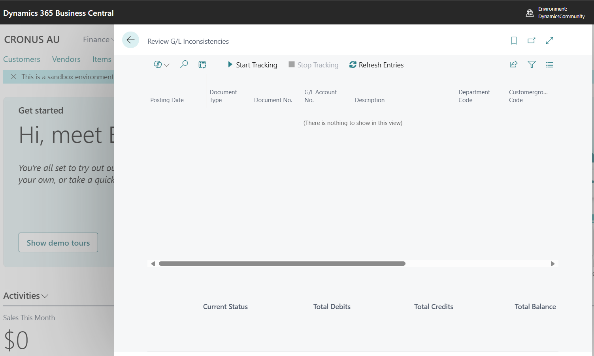
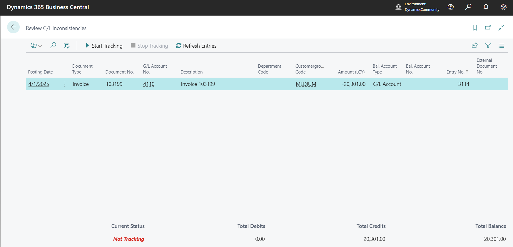
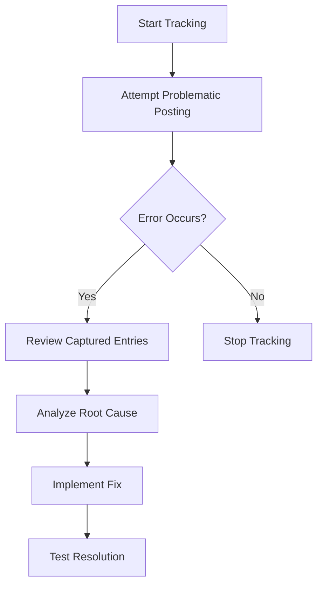

# GL Inconsistency Error Solution for Microsoft Dynamics 365 Business Central

[](https://docs.microsoft.com/en-us/dynamics365/business-central/)
[](https://docs.microsoft.com/en-us/dynamics365/business-central/dev-itpro/developer/devenv-programming-in-al)
[](LICENSE)

## 📸 Extension Preview

### Initial State - Ready to Track

*The extension interface when first opened, showing "Not Tracking" status and empty data view.*

### Active Tracking - Captured Inconsistent Entry  

*Real-time capture of problematic G/L entry (Invoice 103199) showing the imbalance: -20,301.00 total balance with 20,301.00 in credits.*

## 🔍 What You See in Action

The screenshots above demonstrate the extension's power:

**🎯 Problem Identified**: Invoice 103199 posted on 4/1/2025 shows a clear imbalance
- **G/L Account**: 4110 
- **Amount**: -20,301.00 (Credit)
- **Balance Issue**: Total Credits (20,301.00) don't match Total Debits (0.00)
- **Root Cause**: Missing corresponding debit entry or incorrect posting logic

**📊 Real-Time Analysis**: The extension captured this inconsistency the moment it occurred during posting, providing:
- Exact document number and posting date
- Specific G/L accounts involved  
- Department code (MEDIUM) for dimensional analysis
- Complete entry details including bal. account information

## 🎯 Problem Statement

**Are you experiencing "Inconsistencies in the G/L Entry table" errors in Business Central?**

This frustrating error commonly occurs after version updates (especially BC 26.0+) and during sales order posting, but provides little insight into which specific records are causing the problem. Traditional troubleshooting methods fall short because:

- The error message is generic and non-specific
- G/L Entry records appear correct when manually reviewed
- The inconsistency only manifests during posting operations
- Standard BC tools don't provide real-time transaction analysis

## 🔧 Solution: Real-Time G/L Inconsistency Tracker

This Business Central extension provides a comprehensive diagnostic solution that captures and analyzes G/L entries **exactly when inconsistencies occur** during posting operations.

### 🌟 Key Features

| Feature | Description |
|---------|-------------|
| **🔍 Real-Time Tracking** | Automatically captures G/L entries when inconsistencies are detected during posting |
| **📊 Detailed Analysis** | Shows problematic entries with full details including amounts, accounts, dimensions, and documents |
| **📈 Balance Verification** | Displays total debits, credits, and balance to identify imbalances |
| **⚡ Start/Stop Control** | Enable tracking only when needed to reproduce specific issues |
| **🎯 Targeted Debugging** | Focus on specific transactions without system-wide overhead |

## 🚀 Quick Start Guide

### Installation
1. Download the latest `.app` file from [Releases](../../releases)
2. Install the extension in your Business Central environment
3. Navigate to **"Review G/L Inconsistencies"** page

### Usage Workflow


### Step-by-Step Troubleshooting

1. **📋 Prepare for Analysis** *(See Screenshot 1)*
   - Open "Review G/L Inconsistencies" page
   - Click **"Start Tracking"** button
   - Status will show "Tracking" in green

2. **🔄 Reproduce the Issue**
   - Attempt the posting operation that causes the error
   - The extension automatically captures inconsistent G/L entries

3. **📊 Analyze Results** *(See Screenshot 2)*
   - Click **"Refresh Entries"** to see captured data
   - Review the totals: Debits, Credits, and Balance
   - Examine individual entries for anomalies

4. **🎯 Identify Root Cause**
   - Look for rounding differences
   - Check dimension postings
   - Verify account mappings
   - Analyze multi-currency calculations

**💡 Pro Tip**: The second screenshot shows a perfect example - Invoice 103199 has only credit entries (20,301.00) with no corresponding debit entries, creating the -20,301.00 imbalance.

## 📋 Common Inconsistency Scenarios

### 🔥 Real Example from Screenshots
**Issue**: Invoice 103199 - Missing Debit Entries
- **Symptom**: Total Balance = -20,301.00 (Credits exceed Debits)
- **Analysis**: Only credit entry to G/L Account 4110 exists
- **Solution**: Investigate why corresponding debit entry wasn't created
- **Likely Cause**: Custom posting routine or account mapping error

### Scenario 1: Rounding Differences
**Symptoms:** Total balance shows small amounts (0.01, 0.02)
**Solution:** Review currency exchange rates and rounding setup

### Scenario 2: VAT Calculation Issues  
**Symptoms:** Imbalance in VAT-related G/L accounts
**Solution:** Check VAT posting groups and calculation methods

### Scenario 3: Dimension Posting Problems
**Symptoms:** Entries with missing or incorrect dimension values
**Solution:** Verify dimension posting rules and mandatory settings

### Scenario 4: Custom Posting Routines
**Symptoms:** Imbalance in custom G/L accounts (like the example above)
**Solution:** Review custom posting code for proper balancing

## 🛠️ Technical Details

### Architecture
- **Codeunit 50100**: `G/L Inconsistencies Mgt.` - Core tracking logic
- **Page 50100**: `Review G/L Inconsistencies` - User interface for analysis
- **Event Subscriber**: Hooks into `Gen. Jnl.-Post Line` for real-time capture

### Event Integration
```al
[EventSubscriber(ObjectType::Codeunit, Codeunit::"Gen. Jnl.-Post Line", 
OnAfterFinishPosting, '', false, false)]
```

### Data Capture
The extension temporarily stores G/L entries when `IsTransactionConsistent = false`, allowing for detailed post-mortem analysis.

## 🔧 System Requirements

- **Business Central Version:** 25.0+ (tested up to 26.0)
- **Permissions Required:** G/L Entry table read access
- **Object Range:** 50100-50149

## 📖 Forum Response Example

*This extension was created specifically to address community questions like this:*

> **"Inconsistencies in the G/L Entry table" error after BC 26.0 update**
>
> *"I have sales order posting issues. I checked G/L ledger entries but couldn't find unmatched data. How can I fix this?"*

**Answer:** Use this extension to capture the exact G/L entries causing the inconsistency in real-time. Traditional manual review of G/L entries after the fact often misses the problematic transactions because they occur during the posting process itself.
## 🤝 Contributing

Found a bug or have a feature request? 

1. **🐛 Report Issues**: Use GitHub Issues for bug reports
2. **💡 Feature Requests**: Describe your use case and requirements  
3. **🔧 Pull Requests**: Fork, develop, and submit PRs for improvements

## 📄 License

This project is licensed under the MIT License - see the [LICENSE](LICENSE) file for details.

## 👨‍💻 Author

**Jeffrey Bulanadi**  
*Business Central Developer & Consultant*

- 🔗 LinkedIn: [jeffreybulanadi](https://www.linkedin.com/in/jeffreybulanadi/)
- 🐙 GitHub: [jeffreybulanadi](https://github.com/jeffreybulanadi)

## 🙏 Acknowledgments

- Microsoft Dynamics 365 Business Central team for the robust AL development platform
- Business Central community for sharing common pain points and solutions
- Forum contributors who highlighted the need for better G/L inconsistency diagnostics

---

**⭐ If this extension helped resolve your G/L inconsistency issues, please consider starring this repository!**

### 📊 Extension Stats


